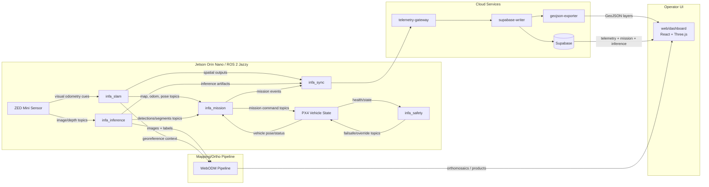

# INF_A Monorepo Bootstrap

This repository provides a top-level workspace layout for autonomous field robotics software spanning onboard ROS 2 autonomy, cloud/data services, operator UI, deployment operations, and system documentation.

## 1) Target hardware/software matrix

| Layer | Target |
|---|---|
| Edge compute | NVIDIA Jetson Orin Nano |
| Robot middleware | ROS 2 Jazzy |
| Flight stack / vehicle interface | PX4 |
| Perception sensor | ZED Mini |
| UI stack | React + Three.js |
| Cloud/data services | Telemetry gateway, Supabase writer, GeoJSON exporter |

## 2) Package and directory responsibilities

### `ros2_ws/src/` (ROS 2 workspace packages)
- `infa_slam/`: Mapping, localization, odometry fusion, and map publication.
- `infa_mission/`: Mission planning, waypoint sequencing, task execution state machine.
- `infa_safety/`: Safety monitors, geofence checks, failsafe triggers, health watchdogs.
- `infa_inference/`: Onboard model execution for detection/segmentation/classification and ROS topic outputs.
- `infa_sync/`: Data synchronization between onboard outputs and offboard/cloud systems.

### `services/` (cloud and data APIs)
- `telemetry-gateway/`: Ingest and normalize telemetry/events from robot edge nodes.
- `supabase-writer/`: Persist curated telemetry, mission state, and inference artifacts to Supabase.
- `geojson-exporter/`: Export spatial traces and labeled outputs as GeoJSON for downstream GIS tooling.

### `web/dashboard/` (operator UI)
- React + Three.js dashboard for live mission status, scene overlays, map context, and review workflows.

### `ops/` (deployment and environment operations)
- Deployment manifests, environment configs, CI/CD glue scripts, startup/shutdown helpers.

### `docs/` (architecture and operations documentation)
- System architecture, interface contracts, runbooks, troubleshooting and maintenance guidance.

## 3) Local and simulation run instructions

> Initial scaffold only. Add concrete package/service startup commands as implementation is added.

### A. ROS 2 workspace bootstrap
```bash
cd ros2_ws
colcon build
source install/setup.bash
```

### B. Run core ROS 2 nodes (example skeleton)
```bash
# In separate terminals after sourcing setup.bash
ros2 run infa_slam slam_node
ros2 run infa_inference inference_node
ros2 run infa_mission mission_node
ros2 run infa_safety safety_node
ros2 run infa_sync sync_node
```

### C. Launch cloud/data services locally (example skeleton)
```bash
cd services/telemetry-gateway && ./run-local.sh
cd services/supabase-writer && ./run-local.sh
cd services/geojson-exporter && ./run-local.sh
```

### D. Launch dashboard locally (example skeleton)
```bash
cd web/dashboard
npm install
npm run dev
```

### E. Sim-first integration loop
1. Start PX4 SITL and any sensor simulation feeds.
2. Launch ROS 2 Jazzy nodes in `ros2_ws/src/*`.
3. Verify topic contracts and inference outputs.
4. Start `services/*` and ensure persistence/export paths are healthy.
5. Open dashboard and validate live visualization + control loop.

## 4) Data flow diagram


